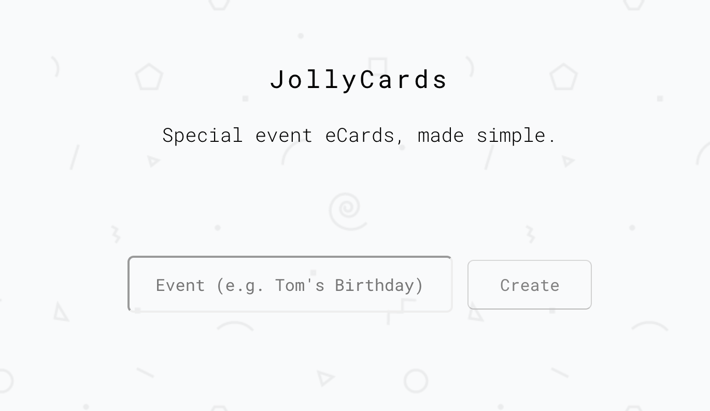

# JollyCards

A free, online alternative to physical birthday/special occasion cards.



Stores images in AWS S3 and uses Redis for storing page titles and image names.

Example Redis entry for a page:
```
"fb7c0ec6-381e-4988-8812-8529d10e6e8a_title" : "Tom's Birthday"
"fb7c0ec6-381e-4988-8812-8529d10e6e8a_images" : [
    "4f1ba321-d709-4279-b69a-5b4031cbc4f2.png",
    "eba519b6-98bd-48fd-ad53-5d144c76beb6.png"
]
```

## Env vars
```
REDIS_URL (if using dokku, will be automatically set when linking with Redis service)
AWS_AK (AWS access key for S3 access)
AWS_SK (AWS secret key for S3 access)
AWS_S3_REGION (e.g. eu-west-1)
AWS_S3_BUCKET
PORT (optional, not required if using dokku, defaults to 8080)
```

## Run

Local (don't forget to set env vars):
`npm install && npm start`

Using [dokku](http://dokku.viewdocs.io/dokku/):
* Create `jollycards` app on dokku
* Create a Redis service on dokku using this [plugin](https://github.com/dokku/dokku-redis) and link it with `jollycards` (this will set the `REDIS_URL` env var)
* Set the rest of the env vars on dokku (`PORT` not required):
`dokku config:set jollycards <ENV>=<VALUE>`
* Set the dokku remote in the git repo: 
`git remote add dokku dokku@example.com:jollycards`
* Deploy:
`git push dokku master`
